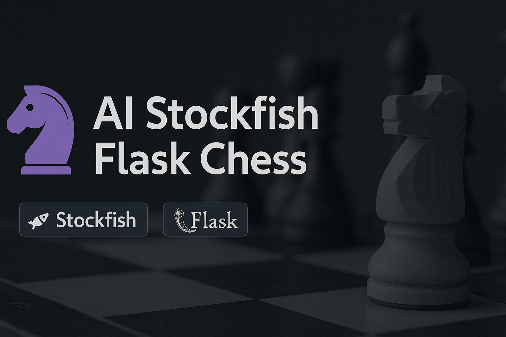
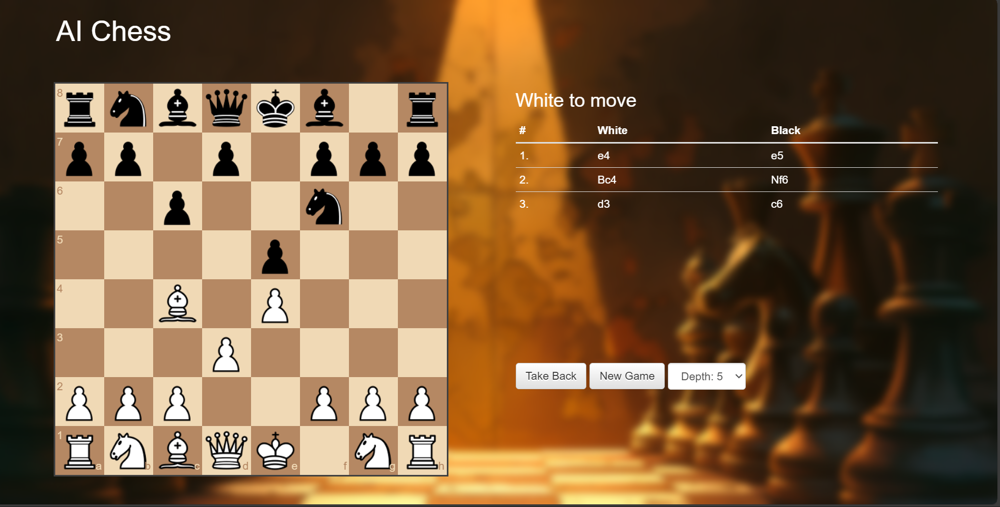

# 🤖♟️ AI Stockfish Flask Chess Game

<p align="center">
  
</p>

> Play against the Stockfish chess engine directly in your browser using a Flask-powered web app.

---

<p align="center">
  
  
  
  
</p>

---

## 🧭 Overview

**AI Stockfish Flask Chess** is a powerful web-based chess application built using **Flask** and integrated with the **Stockfish AI engine**.  
Play chess against one of the strongest engines in the world, directly inside your browser.

Key points:

- Modern UI  
- Real-time move validation  
- Stockfish AI opponent  
- Clean backend structure  
- Easy to install and run  

---

## ✨ Features

- ♟️ Play chess online locally in your browser  
- 🤖 AI opponent powered by Stockfish  
- 🔍 Move analysis & validation  
- 🎨 Responsive UI using HTML/CSS/JS  
- ⚡ Fast Flask backend  
- 🧪 Board logic testing script  
- 📁 Organized project folder structure  

---

## 📁 Project Structure

```text
AI-Stockfish-Flask-Chess/
├── screenshots/           # Add screenshot folder
├── static/                # Arrange the code
├── stockfish/             # Add stockfish
├── templates/             # Add templates folder with HTML file
├── .gitattributes         # update This file
├── Dockerfile             # Update Dockerfile
├── LICENSE                # Add LICENSE file
├── README.md              # Update README.MD FILE
├── app.py                 # Update app.py
├── board_test.py          # Add a python file
└── requirements.txt       # Update requirements.txt
```

---

## 🛠 Installation Guide

### 1️⃣ Clone the repository

```sh
git clone https://github.com/yourusername/AI-Stockfish-Flask-Chess.git
cd AI-Stockfish-Flask-Chess
```

---


### 2️⃣ Create a virtual environment

#### ✅ Windows

```sh
python -m venv venv
venv\Scripts\activate
```

#### ✅ macOS / Linux

```sh
python3 -m venv venv
source venv/bin/activate
```

---

### 3️⃣ Install dependencies

```sh
pip install -r requirements.txt
```

---

## ▶️ Run the Application

```sh
python flask_app.py
```

Then open in your browser:

```text
http://127.0.0.1:5000/
```

---

## 🎮 Usage
---

- Open the web app in your browser  
- White moves first — click a piece, then click a valid square  
- The AI (Stockfish) responds with its best move  
- Use it to play, test, and analyze positions  

---

## 🖼️ Screenshots
---

<p align="center">
  
</p>

---

## 📦 Tech Stack

- Backend: Python, Flask
- AI Engine: Stockfish
- Frontend: HTML, CSS, JavaScript

---

## 🧭 Roadmap / Ideas

- Add move history panel  
- Add difficulty levels (Stockfish depth/skill)  
- Add chess clock  
- Add FEN/PGN import & export  
- Add online multiplayer (future)  

---

## 🤝 Contributing

- Fork the repository
- Create a branch: git checkout -b feature-name
- Commit changes: git commit -m "Add feature"
- Push: git push origin feature-name
- Open a Pull Request

---

## 🔋 Powered By

- Flask
- Stockfish Chess Engine
- HTML, CSS, JavaScript


